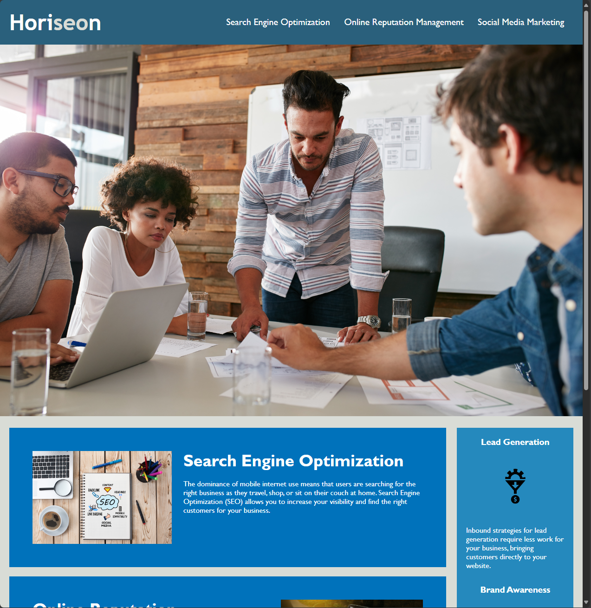
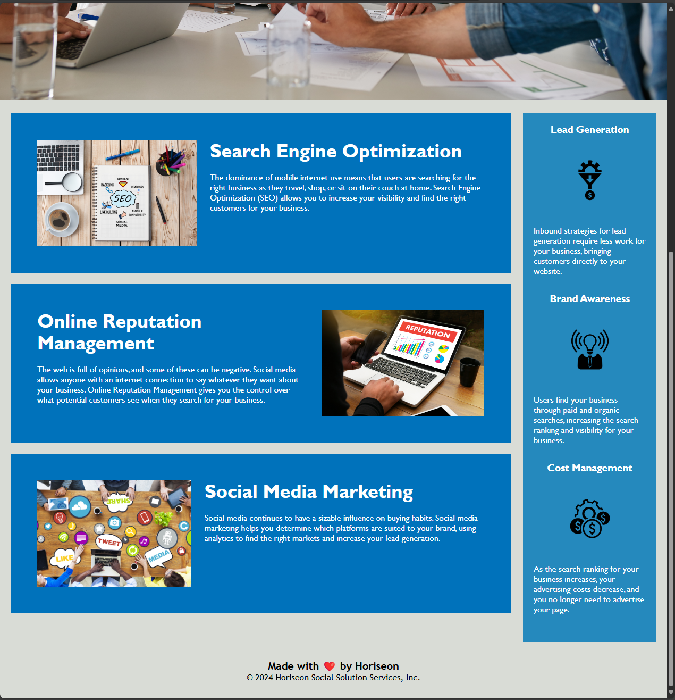

# HTML CSS Git Challenge: Code Refactor

## Description

- The purpose of this website is to serve as advertising for Horiseon Social Solution Services, Inc. by highlighting three main factors of their business. Seach Engine Optimization, Online Reputation Management, & Social Media Marketing. Once a part of the project, I improved the codebase for long-term sustainability by making sure some links that werent working functioned properly, replacing all divs with proper HTML semantics, adding alt text to images for accessibility purposes, significantly consolidating CSS to increase readability & efficiency, as well as adding comments to further explain codes function.

Provide a short description explaining the what, why, and how of your project. Use the following questions as a guide:

- What was your motivation?
- Why did you build this project? (Note: the answer is not "Because it was a homework assignment.")
- What problem does it solve?
- What did you learn?

## Usage

Provide instructions and examples for use. Include screenshots as needed.


    ```md



    ```

## Credits

Creator: Jose Guache

## License

[](https://opensource.org/licenses/MIT)

---

## Badges

